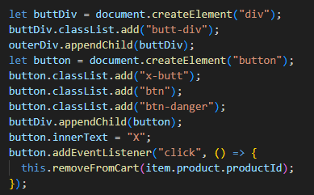
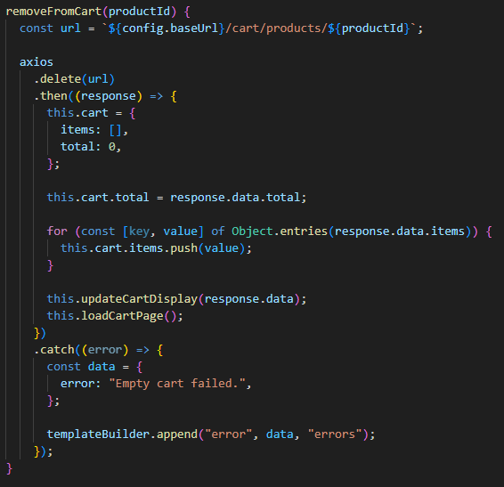

# 
Artisanal Shop

---
### 
 This program is an e-commerce site for buying and selling goods from the Artisanal Shop

---

## 
My Important Classes
| Class                                 | Purpose                                                                                                                                                                      |
|---------------------------------------|------------------------------------------------------------------------------------------------------------------------------------------------------------------------------|
| 
 ShoppingCart(controller/dao) | 
 These classes are where the logic for manipulating shopping cart information happens. A request is made every time someone adds or removes a shopping cart item.    |
| 
 Product(controller/dao)      | 
 These classes receive, create, and update product information such as name, price, and category. Also used in conjunction with category classes to filter products. |
| 
 Category(controller/dao)     | 
 These classes work in conjunction with product classes to not only filter products but add, remove, or update existing categories in the database.                  |

## 
Interesting Code

### 
So that users won't have to completely wipe their cart each time they add an accidental item, I implemented a button onto each shopping cart item that allows users to individually remove unwanted items.

---

### 
This function was implemented to handle each shopping cart item's remove button. After calling to the api, the shopping cart page is refreshed with the updated cart.